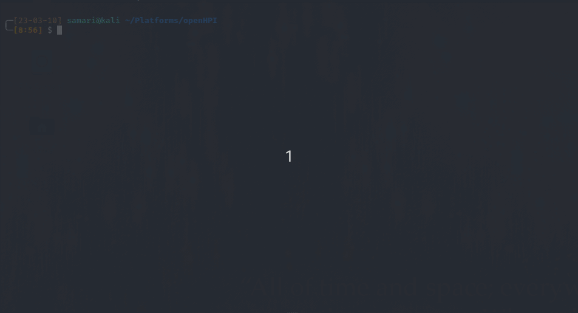

# Coffee Machine

> Tired students, it is monday morning.... 😴☕️ The student representative group therefore provides valuable coffee via a coffee machine accessible to the students. Of course, it is connected to the internet and provides access to the control interface. Can you find out who spends all their money on coffee?

Es handelt sich um einen Kaffeeautomaten, der mir einfach keinen Kaffee ausgeben will.

Um das richtige Passwort für die Transaktionen zu finden, habe ich das Programm mit dem Debugger radare2 gestartet und einen Breakpoint in der Main-Function gesetzt an der Stelle, an der das eingegebene Passwort überprüft wird.

Mit diesem gefundenen Passwort lässt sich die erste Flag ergattern. Die zweite flag findet man mit `strings coffee-control` als plaintext. 